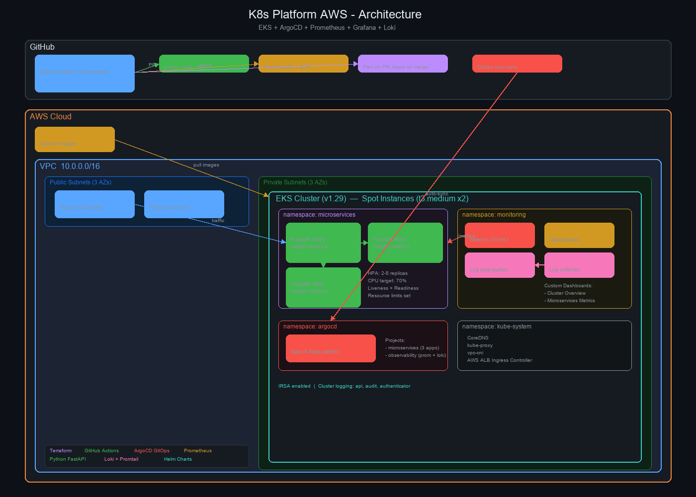

# K8s Platform AWS

Production-grade Kubernetes platform on AWS EKS with GitOps (ArgoCD), full observability (Prometheus + Grafana + Loki), and CI/CD automation (GitHub Actions) — all provisioned via Terraform.


## Architecture



### Components

| Layer | Technology | Purpose |
|-------|-----------|---------|
| Infrastructure | Terraform + AWS | VPC, EKS cluster, ECR, IAM |
| Container Orchestration | EKS (Kubernetes) | Managed K8s with spot instances |
| GitOps | ArgoCD | Declarative deployments from Git |
| Monitoring | Prometheus + Grafana | Metrics collection + dashboards |
| Logging | Loki + Promtail | Centralized log aggregation |
| Applications | Python FastAPI | 3 microservices with /health and /metrics |
| CI/CD | GitHub Actions | Test, build, push, deploy pipeline |

### Microservices

- **api-gateway** — Routes requests to downstream services, exposes Prometheus metrics
- **order-service** — CRUD operations for orders with in-memory store
- **notification-service** — Manages notifications with in-memory store

## Prerequisites

- AWS CLI configured with appropriate permissions
- Terraform >= 1.5
- kubectl
- Docker
- Python >= 3.12 (for local development)

## Quick Start

```bash
# Clone the repository
git clone https://github.com/lilkhalatyan/k8s-platform-aws.git
cd k8s-platform-aws

# Configure your variables
cp terraform/terraform.tfvars.example terraform/terraform.tfvars
# Edit terraform.tfvars with your values

# Deploy everything
make infra-up

# Verify the cluster
make health-check

# Access ArgoCD UI (get password from output)
make argocd-password
```

## Cost Estimate

| Resource | Monthly Cost |
|----------|-------------|
| EKS Cluster | ~$73 |
| EC2 Spot Instances (2x t3.medium) | ~$15-20 |
| NAT Gateway (single) | ~$32 |
| ALB | ~$16 |
| ECR Storage | ~$1 |
| **Total (running)** | **~$70-100/mo** |
| **Total (torn down)** | **$0** |

> Designed for minimal cost. Use `make infra-down` to tear down everything when not in use.

## Teardown

```bash
# Destroy all infrastructure (prompts for confirmation)
make infra-down
```

## Project Structure

```
k8s-platform-aws/
├── terraform/          # Infrastructure as Code (VPC, EKS, ECR, ArgoCD)
├── kubernetes/         # K8s manifests + ArgoCD apps + observability configs
├── apps/               # Python FastAPI microservices (source + Dockerfiles)
├── scripts/            # Automation (health checker, cluster report, setup/teardown)
├── .github/workflows/  # CI/CD pipelines
├── docs/               # Architecture docs and diagrams
└── Makefile            # Common commands
```

## Key Design Decisions

- **Spot instances** for worker nodes — ~60% cost savings over on-demand
- **Single NAT gateway** — saves ~$65/mo vs one-per-AZ
- **App-of-apps pattern** for ArgoCD — industry best practice for managing multiple apps
- **kube-prometheus-stack** — single Helm chart for Prometheus + Grafana
- **In-memory data stores** — keeps focus on infrastructure, zero database cost
- **FastAPI** — modern Python framework with auto-generated OpenAPI docs

## License

MIT
